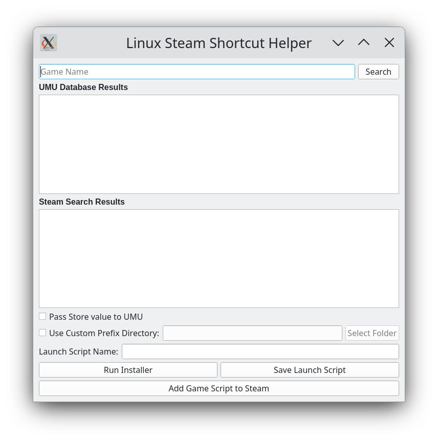

# Linux Steam Shortcut Helper
_A small PyQt helper application for configuring and quickly adding Non-Steam Shortcuts_

## Introduction
Linux Steam Shortcut Helper is a small helper application that aids in configuring Non-Steam Shortcuts. It's targetted at SteamOS on the Steam Deck right now; compatibility with other OSs is unknown at this point and is not guaranteed. It primarily relies on UMU-Launcher to provide steam-pressure-vessel support, as well as protonfixes for games.

## Usage and Workflow
The archetypical workflow is as follows:
1. Search for Game Title
_This will show results in both the UMU database and Steam; if UMU has results, there are probably fixes that will be applied._
2. Run Installer **Currently Broken**
_This will use umu-run to let you run the setup.exe within the new prefix._
***Workaround: can save the script first, using the setup.exe, run, then re-save the script with the game.exe***
3. Save launch script
_This will create a launch script that Steam can use to launch the game via umu-run._
4. Add game to Steam
_This will use the information provided to get art assets where possible, and add the launch script to Steam's shortcuts.vdf file._

## Advantages
Advantages of this method include:

**Much greater control over prefix directory location, including:**
:white_check_mark: Custom prefix directory support per game (allows individual change per game, or can share across multiple or all games)
:white_check_mark: Global prefix directory moving (can store all prefixes on microSD or wherever desired)
_Since Steam is launching a .sh file, it does not create a folder in the compatdata dir. No more orphaned directories!_

**Benefits of launching game via umu-run**
:white_check_mark: Receive both Valve and Community fixes (via Valve-ProtonFixes and UMU-ProtonFixes) as we determine the game and pass that to umu-run, rather than just running an .exe in Steam
:white_check_mark: Auto-update to the latest UMU-Proton version
:white_check_mark: Set desired Proton version _currently done via script_

**Automatically get official art and icons**
:white_check_mark: Use Steam AppID to get the official store header/hero/capsule/icon where available
:black_square_button: Use SteamGridDB to get missing artwork where needed _in progress_

